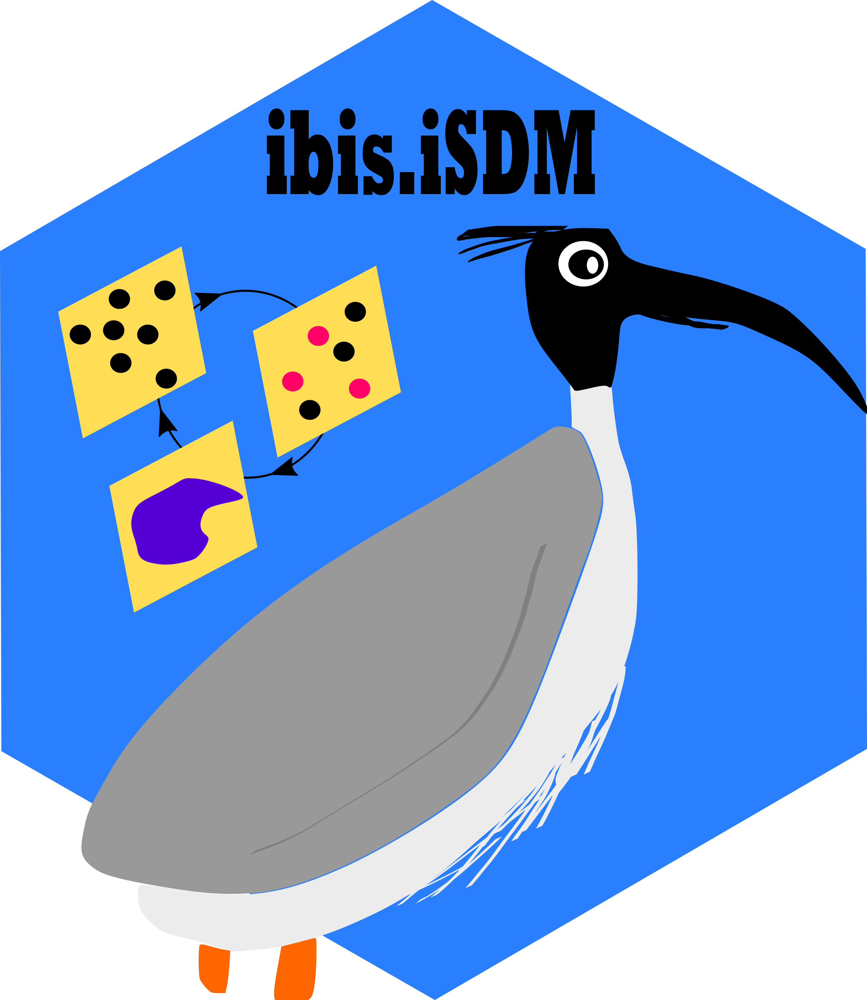

---
output:
  rmarkdown::github_document:
    html_preview: no
---

<!-- README.md is generated from README.Rmd. Please use this file for any edits -->

```{r, echo = FALSE, include = FALSE}
knitr::opts_chunk$set(
  collapse = TRUE,
  comment = "#>"
)
```

# The ibis framework - An **I**ntegrated model for **B**iod**I**versity distribution projection**S**



<!-- https://shields.io/  For Badges later -->
<!-- badges: start -->

[](https://lifecycle.r-lib.org/articles/stages.html#experimental)
[](https://github.com/iiasa/ibis.iSDM/actions/workflows/R-CMD-check.yaml)
[](https://creativecommons.org/licenses/by/4.0/)
[](https://app.codecov.io/gh/iiasa/ibis.iSDM?branch=master)
<!-- badges: end -->
  
The **ibis.iSDM** package provides a series of convenience functions to fit integrated Species Distribution Models (iSDMs). With integrated models we generally refer to SDMs that incorporate information from different biodiversity datasets, external parameters such as priors or offsets with respect to certain variables and regions. See [Fletcher et al. (2019)](https://esajournals.onlinelibrary.wiley.com/doi/abs/10.1002/ecy.2710) and [Isaac et al. (2020)](https://linkinghub.elsevier.com/retrieve/pii/S0169534719302551) for an introduction to iSDMs.

## Installation

The latest version can be installed from GitHub. A CRAN release is planned.

```{r gh-installation, eval = FALSE, message=FALSE}
# For CRAN installation (Not yet done)
# install.packages("ibis.iSDM")

# For Installation directly from github
install.packages("remotes")
remotes::install_github("IIASA/ibis.iSDM")
```

## Basic usage

See relevant [reference site](https://iiasa.github.io/ibis.iSDM/) and [articles](https://iiasa.github.io/ibis.iSDM/articles/01_train_simple_model.html).

Note that the package is in active development and parameters of some functions might change.

**Citation:**

Jung, Martin. 2023. “An Integrated Species Distribution Modelling Framework for Heterogeneous Biodiversity Data.” Ecological Informatics, 102127, [DOI](https://doi.org/10.1016/j.ecoinf.2023.102127)


## Acknowledgement <a href="https://iiasa.ac.at"></a>

**ibis.iSDM** is developed and maintained by the Biodiversity, Ecology and Conservation group at the International Institute for Applied Systems Analysis (IIASA), Austria.

## Contributors

<!-- ALL-CONTRIBUTORS-LIST:START - Do not remove or modify this section -->
<!-- prettier-ignore-start -->
<!-- markdownlint-disable -->

All contributions to this project are gratefully acknowledged using the [`allcontributors` package](https://github.com/ropenscilabs/allcontributors) following the [all-contributors](https://allcontributors.org) specification. Contributions of any kind are welcome!

<table>

<tr>
<td align="center">
<a href="https://github.com/Martin-Jung">

</a><br>
<a href="https://github.com/iiasa/ibis.iSDM/commits?author=Martin-Jung">Martin-Jung</a>
</td>
<td align="center">
<a href="https://github.com/mhesselbarth">

</a><br>
<a href="https://github.com/iiasa/ibis.iSDM/commits?author=mhesselbarth">mhesselbarth</a>
</td>
</tr>

</table>

<!-- markdownlint-enable -->
<!-- prettier-ignore-end -->
<!-- ALL-CONTRIBUTORS-LIST:END -->

