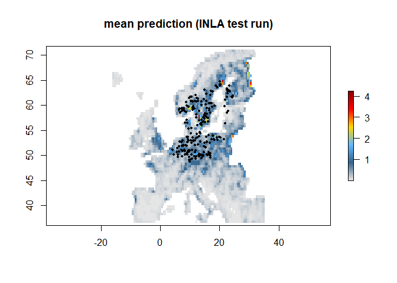
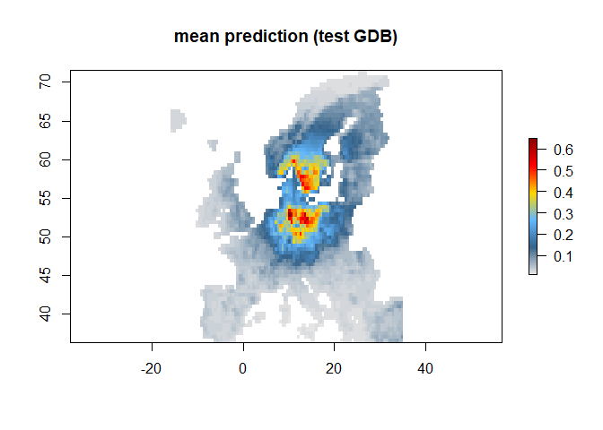
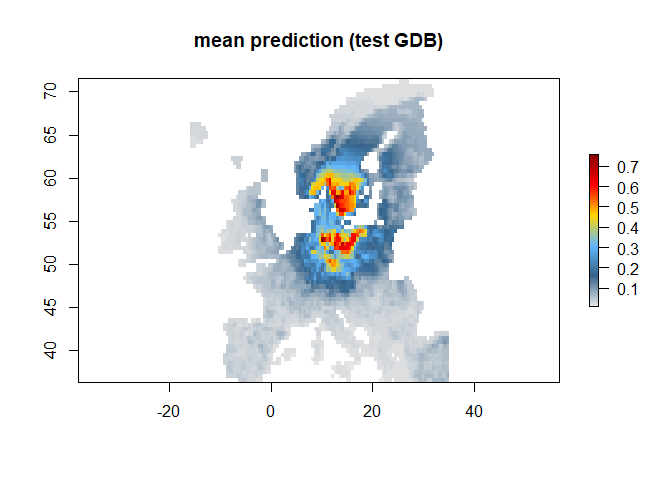
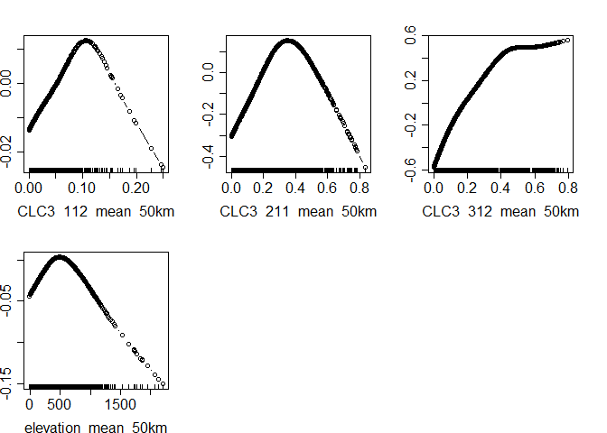

<!-- README.md is generated from README.Rmd. Please use this file for any edits-->

# The ibis framework - An **I**ntegrated model for **B**iod**I**versity distribution projection**S**

<!-- <a href='https://github.com/iiasa/rN2000'></a> --->

The ibis.iSDM package provides a series of convenience functions to fit
integrated Species Distribution Models (iSDMs). With integrated models
we generally refer to SDMs that incorporate information from different
biodiversity datasets, external parameters such as priors or offsets or
constrains such as vital rates with respect to certain variables and
regions. See [Fletcher et
al. (2019)](https://onlinelibrary.wiley.com/doi/abs/10.1002/ecy.2710)
and [Isaac et
al. (2020)](https://linkinghub.elsevier.com/retrieve/pii/S0169534719302551)
for an overview.

Isn’t this just another SDM package? Indeed it is, but building our own
modelling infrastructure allows greater flexibility in how models are
created and run. It is less about reinventing the wheel, but rather
bringing strengths from different tools together. *Not exhaustive list
acknowledging other SDM packages in R:*

-   [hSDM](https://github.com/ghislainv/hSDM) -&gt; Bayesian framework
    for mixed models. Fast, but little flexibility with regards to
    weights or offsets
-   [multispeciesPP](https://github.com/wfithian/multispeciesPP) -&gt;
    Not been further developed since years
-   [inlabru](https://github.com/inlabru-org/inlabru) -&gt; Package
    specifically for LGCP with INLA, however little support to other
    engines, likelihoods or data
-   [pointedSDMs](https://github.com/oharar/PointedSDMs) -&gt; INLA
    based SDM package for integrating different datasets.
-   [biomod2](https://github.com/biomodhub/biomod2) -&gt; Popular
    package for ensemble modeling, but no integration, not Bayesian
-   [sdmTMB](https://github.com/pbs-assess/sdmTMB) -&gt; Package for
    fitting spatial-Temporal SDMs
-   [modleR](https://github.com/Model-R/modleR) -&gt; similar as biomod2
    a wrapper to construct ensembles of models

## Installation

Currently only as development version on GitHub.

``` r
install.packages("devtools")
devtools::install_github("IIASA/ibis")
```

## Features and next key milestones

-   ✅ Fitting Point Poisson Models (PPMs) using INLA and at least
    another Engine
-   ✅ Basic documentation present that however can be further improved
-   ✅ Various functions to include offsets, ranges, predictor
    transformations
-   ✅ Plotting functions for models and effect are there
-   🚧 Actually support multiple likelihoods depending on included
    biodiversity dataset
-   🚧 Add a wrapper for PPMs in Stan as new engine for max flexibility
-   🚧 Implement options to add occupancy model for detectability, see
    [Altwegg and
    Nichols](https://onlinelibrary.wiley.com/doi/abs/10.1111/2041-210X.13090)
    and [Guillera-Arroita](http://doi.wiley.com/10.1111/ecog.02445)
-   🚧 Add new class for priors and ensure that they linked in a flexible
    manner
-   🚧 There are reports that iCAR can
    [outperforms](https://arxiv.org/pdf/1204.6087v1.pdf) Matern
    covariance? It likely is also considerably faster, thus could be
    implemented
-   🚧 Create a pkgdown website for the package with tutorials (see
    below)
-   …

## Development guidelines

-   The ibis.iSDM contains primarily functions for fitting models.
-   Speed and flexibility are key
-   Don’t repeat yourself. Create new functions and if necessary
    classes. Equally try to reuse common names from R, e.g. \[`plot`\],
    \[`summary`\]
-   Avoid using additional package dependencies where possible
-   Comment your code!!
-   Use assertions to verify inputs to functions
-   If bored, please write unit tests and ensure they all evaluate
    (CRTL+SHIFT+T)!

*Note that pushing to master or forking is disabled at the moment. Pull
requests require a confirmation.*

## Usage

Note that the package in constant development and individual functions
might change. As soon as the package has reached a stable state, the
repository will be made public An official release will be made as soon
as the package is public **In development !!!**

### Load package and make a basic model

``` r
library(ibis)
#> Warning: replacing previous import 'mboost::extract' by 'raster::extract' when
#> loading 'ibis'
#> Warning: replacing previous import 'mboost::cv' by 'raster::cv' when loading
#> 'ibis'
library(raster)
#> Warning: package 'raster' was built under R version 4.0.3
#> Warning: package 'sp' was built under R version 4.0.3
library(sf)
#> Warning: package 'sf' was built under R version 4.0.3

# Background area for prediction
background <- raster::raster(system.file('extdata/europegrid_50km.tif', package='ibis'))

# Get test species
virtual_points <- sf::st_read(system.file('extdata/input_data.gpkg', package='ibis'),'points',quiet = TRUE)
virtual_range <- sf::st_read(system.file('extdata/input_data.gpkg', package='ibis'),'range',quiet = TRUE)

# Get list of test predictors
ll <- list.files(system.file('extdata/predictors/',package = 'ibis'),full.names = T)
predictors <- raster::stack(ll);names(predictors) <- tools::file_path_sans_ext(basename(ll))

# --- #
# Create a distribution object
x <- distribution(background) %>%
  # Add the presence only points (poipo) as dataset
  add_biodiversity_poipo(virtual_points,field_occurrence = 'Observed',name = 'Virtual points') %>%
  # Add the environmental predictors and also scale them
  add_predictors(predictors,transform = 'scale') %>% 
  # Use INLA with default parameters as fitting engine
  engine_inla()

# print out the model information
print(x)
```

Now train a model using INLA

``` r
# Train a Model with the chosen engine
mod <- train(x, runname = 'INLA test run')
#> Warning in sparse.model.matrix(object, data = data, contrasts.arg =
#> contrasts.arg, : variable 'int.strategy' is absent, its contrast will be ignored

#> Warning in sparse.model.matrix(object, data = data, contrasts.arg =
#> contrasts.arg, : variable 'int.strategy' is absent, its contrast will be ignored
#> Warning in points2grid(points, tolerance, round): grid has empty column/rows in
#> dimension 1

# Shows the strongest effect by direction
mod

# Summary of effects
summary(mod)
#> # A tibble: 15 x 8
#>    variable     mean      sd `0.05quant` `0.5quant` `0.95quant`     mode     kld
#>    <chr>       <dbl>   <dbl>       <dbl>      <dbl>       <dbl>    <dbl>   <dbl>
#>  1 interce~ -0.00528 2.83e-4    -0.00576   -0.00528    -0.00483 -0.00527 4.75e-7
#>  2 aspect_~  0.232   1.97e-1    -0.0916     0.231       0.557    0.230   8.75e-7
#>  3 bio01_m~ -0.703   2.14e-1    -1.06      -0.701      -0.353   -0.698   2.50e-7
#>  4 bio03_m~ -0.0346  1.73e-1    -0.319     -0.0354      0.252   -0.0369  7.51e-7
#>  5 bio19_m~  0.223   1.27e-1     0.00865    0.227       0.427    0.233   8.61e-7
#>  6 CLC3_11~  0.0922  1.00e-1    -0.0755     0.0937      0.255    0.0967  3.16e-8
#>  7 CLC3_13~  0.0384  5.85e-2    -0.0624     0.0409      0.130    0.0461  2.60e-6
#>  8 CLC3_21~  0.202   1.47e-1    -0.0385     0.201       0.444    0.200   6.53e-7
#>  9 CLC3_31~  0.727   9.15e-2     0.576      0.726       0.878    0.726   9.07e-7
#> 10 CLC3_33~ -0.182   2.85e-1    -0.713     -0.140       0.209   -0.0388  1.36e-6
#> 11 elevati~ -0.250   1.97e-1    -0.581     -0.247       0.0678  -0.239   1.83e-7
#> 12 hmi_mea~  0.897   1.93e-1     0.577      0.897       1.21     0.899   8.65e-7
#> 13 koeppen~  0.418   1.82e-1     0.121      0.416       0.722    0.412   3.49e-8
#> 14 ndvi_me~  0.0759  1.51e-1    -0.170      0.0742      0.327    0.0709  3.84e-8
#> 15 slope_m~  0.108   1.97e-1    -0.214      0.106       0.433    0.104   5.59e-7

# Now plot the prediction
plot(mod)
plot(as(virtual_points,'Spatial'),pch = 19, cex = .5, add = TRUE)
```

<!-- -->

Other datasets can be added to the call above as well as for instance
specific latent factors \[`add_latent_spatial()`\] or offsets
\[`add_range_offset()`\].

Equally it is possible to run poisson models with spatial latent effect
on their (equivalent to a kernel density estimation)

``` r
# Distribution model with spatial only
spatialonly <- distribution(background) %>%
  add_biodiversity_poipo(virtual_points, field_occurrence = 'Observed', name = 'Virtual points') %>%
  add_latent_spatial() %>%
  engine_inla(
    max.edge = c(1, 5),
    offset = c(1, 1),
    cutoff = 1,
    proj_stepsize = NULL
    )

# Train a model
mod1_spatialonly <- train(spatialonly, runname = 'test')
#> Warning in sparse.model.matrix(object, data = data, contrasts.arg =
#> contrasts.arg, : variable 'int.strategy' is absent, its contrast will be ignored

#> Warning in sparse.model.matrix(object, data = data, contrasts.arg =
#> contrasts.arg, : variable 'int.strategy' is absent, its contrast will be ignored
#> Warning in points2grid(points, tolerance, round): grid has empty column/rows in
#> dimension 1
plot(mod1_spatialonly)
```

<!-- -->

### Alternative to INLA - Use Gradient Descent Boosting

``` r
# Use Gradient descent boosting engine for prediction
x <- distribution(background) %>%
  add_biodiversity_poipo(virtual_points, field_occurrence = 'Observed', name = 'Virtual points') %>%
  # No further transformation
  add_predictors(predictors, transform = 'none',derivates = 'none') %>%
  # Figured that we don't want the human modification index, so remove the variable again
  rm_predictors('hmi_mean_50km') %>%
  # Add latent spatial effect
  add_latent_spatial() %>%
  # Use GDB for estimation with very few iterations for testing
  engine_gdb(boosting_iterations = 500,learning_rate = 0.1)

# Print the setup of data
x

# Train a model
mod2 <- train(x, runname = 'test GDB')
#> Warning: Using formula(x) is deprecated when x is a character vector of length > 1.
#>   Consider formula(paste(x, collapse = " ")) instead.
mod2

# Same as for INLA plot the mean prediction
plot(mod2)
```

<!-- -->

``` r
# Plot the partial effects
effects(mod2)
```

<!-- -->
