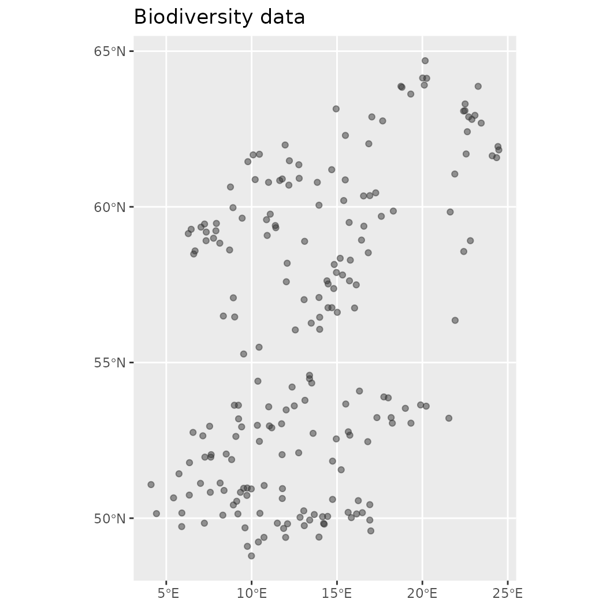

# Train a basic model

The examples below demonstrate how to fit a basic model with the
ibis.iSDM package using a variety of engines. The ibis.iSDM package
loosely follows the **tidyverse** strategy where a model is built by
adding different components via pipes. Every model needs to have a
minimum of at least 3 components:

- A background layer that delineates the modelling extent. This layer
  can be supplied as `sf` or `RasterLayer` object and provides the
  package with general knowledge about the modelling extent, the
  geographic projection and grain size as well as areas with no (`NA`)
  and valid data range (`1` or other values).

- Spatial-explicit biodiversity distribution data such as point or
  polygon data on species or ecosystems. Methods to add those are
  available in functions that start with \[`add_biodiversity_*`\] can be
  of various types. Types in this context refer to the form the
  biodiversity data was raised, such as presence-only or
  presence-absence information. There are ways to convert for instance
  presence-only

- A engine to do the estimation. Like many other species distribution
  modelling approaches, the ibis.iSDM package makes use of Bayesian and
  Machine Learning approaches to do the estimation. While writing this
  text the package supports a total of 7
  (`length(getOption("ibis.engines") )`) different engines, each with
  their own modelling approaches.

------------------------------------------------------------------------

### Load package and make a basic model

``` r
# Load the package
library(ibis.iSDM)
library(inlabru)
library(xgboost)
library(terra)
library(uuid)
library(assertthat)

# Don't print out as many messages
options("ibis.setupmessages" = FALSE)
```

Creating a model in the `ibis.iSDM` package is relatively
straightforward which we demonstrate here with some of testdata that
come with the package. These data show the distribution of a simulated
forest-associated species for northern Europe. There are also some test
predictors available for modelling. So first lets load the data:

``` r
# Background layer
background <- terra::rast(system.file("extdata/europegrid_50km.tif",package = "ibis.iSDM", mustWork = TRUE))
# Load virtual species points
virtual_species <- sf::st_read(system.file("extdata/input_data.gpkg",package = "ibis.iSDM", mustWork = TRUE), "points") 
#> Reading layer `points' from data source 
#>   `/home/runner/work/_temp/Library/ibis.iSDM/extdata/input_data.gpkg' 
#>   using driver `GPKG'
#> Simple feature collection with 208 features and 5 fields
#> Geometry type: POINT
#> Dimension:     XY
#> Bounding box:  xmin: 4.109162 ymin: 48.7885 xmax: 24.47594 ymax: 64.69323
#> Geodetic CRS:  WGS 84
# Predictors
predictors <- terra::rast(list.files(system.file("extdata/predictors/", package = "ibis.iSDM", mustWork = TRUE), "*.tif",full.names = TRUE))
# Make use only of a few of them
predictors <- subset(predictors, c("bio01_mean_50km","bio03_mean_50km","bio19_mean_50km",
                                   "CLC3_112_mean_50km","CLC3_132_mean_50km",
                                   "CLC3_211_mean_50km","CLC3_312_mean_50km",
                                   "elevation_mean_50km"))
```

For our example model we are going to use ‘Integrated Nested Laplace
approximation (INLA)’ modelling framework as available through the
`INLA` and `inlabru` packages. Both have been implemented separately in
the ibis.iSDM package, but especially when dealing with future scenarios
the use of the `inlabru` package is advised.

Now lets build a simple model object. In this case we make use of
presence-only biodiversity records (`add_biodiversity_poipo`). Any
presence-only records added to an object created through
[`distribution()`](https://iiasa.github.io/ibis.iSDM/reference/distribution.md)
are by default modelled as intensity $\lambda$ through an inhomogeneous
Poisson point process model (PPM), where the Number of Individuals $N$
is integrated as relative rate of occurrence per unit area:
$N_{i} \sim Poisson\left( \lambda_{i}|A_{i} \right)$. Here $\lambda$ can
then be estimated by relating it to environmental covariates
$log\left( \lambda_{i} \right) = \alpha + \beta\left( x_{i} \right)$,
where $i$ is a grid cell.

It is inhomogeneous since the $\lambda$ varies over the whole sampling
extent. In the context of species distribution modelling PPMs are
structurally similar to the popular Maxent modelling framework (see
[Renner & Warton
2013](https://onlinelibrary.wiley.com/doi/10.1111/j.1541-0420.2012.01824.x)
and [Renner et al. 2015](http://doi.wiley.com/10.1111/2041-210X.12352).
Critically, presence-only records can only give an indication of a
biased sampling and thus sampling bias has to be taken somehow into
account, either through careful data preparation, a priori thinning or
model-based control by including covariates $\sigma_{i}$ that might
explain this sampling bias.

``` r

# First we define a distribution object using the background layer
mod <- distribution(background)

# Then lets add species data to it. 
# This data needs to be in sf format and key information is that
# the model knows where occurrence data is stored (e.g. how many observations per entry) as
# indicated by the field_occurrence field.
mod <- add_biodiversity_poipo(mod, virtual_species,
                                      name = "Virtual test species",
                                      field_occurrence = "Observed")

# Then lets add predictor information
# Here we are interested in basic transformations (scaling), but derivates (like quadratic)
# for now, but check options
mod <- add_predictors(mod, 
                      env = predictors,
                      transform = "scale", derivates = "none")

# Finally define the engine for the model
# This uses the default data currently backed in the model,
# !Note that any other data might require an adaptation of the default mesh parameters used by the engine!
mod <- engine_inlabru(mod)

# Print out the object to see the information that is now stored within
print(mod)
#> <Biodiversity distribution model>
#> Background extent: 
#>      xmin: -16.064, xmax: 34.95,
#>      ymin: 36.322, ymax: 71.535
#>    projection: +proj=longlat +datum=WGS84 +no_defs
#>  --------- 
#> Biodiversity data:
#>    Point - Presence only <208 records>
#>  --------- 
#>   predictors:     bio01_mean_50km, bio03_mean_50km, bio19_mean_50km, ... (8 predictors)
#>   priors:         <Default>
#>   latent:         None
#>   log:            <Console>
#>   engine:         <INLABRU>
```

The `print` call at the end now shows some summary statistics contained
in this object, such as the extent of the modelling background and the
projection used, the number of biodiversity datasets added and
statistics on the predictors, eventual priors and which engine is being
used.

Of course all of these steps can also be done in “pipe” using the `|>`
syntax.

``` r
print("Create model")
#> [1] "Create model"

mod <- distribution(background) |> 
       add_biodiversity_poipo(virtual_species,
                              name = "Virtual test species",
                              field_occurrence = "Observed") |>  
      add_predictors(env = predictors, transform = "scale", derivates = "none") |> 
      engine_inlabru() 
```

Also very helpful to know is that this object contains a number of
helper functions that allow easy summary or visualization of the
contained data. For example, it is possible to plot and obtain any of
the data added to this object.

``` r
# Make visualization of the contained biodiversity data
plot(mod$biodiversity)
```



``` r

# Other options to explore
names(mod)
#>  [1] "summary"                     "show_biodiversity_length"   
#>  [3] "show_biodiversity_equations" "show_background_info"       
#>  [5] "show"                        "set_priors"                 
#>  [7] "set_predictors"              "set_offset"                 
#>  [9] "set_log"                     "set_limits"                 
#> [11] "set_latent"                  "set_engine"                 
#> [13] "set_control"                 "set_biodiversity"           
#> [15] "rm_priors"                   "rm_predictors"              
#> [17] "rm_offset"                   "rm_limits"                  
#> [19] "rm_latent"                   "rm_engine"                  
#> [21] "rm_control"                  "priors"                     
#> [23] "print"                       "predictors"                 
#> [25] "plot_offsets"                "plot_bias"                  
#> [27] "plot"                        "offset"                     
#> [29] "name"                        "log"                        
#> [31] "limits"                      "latentfactors"              
#> [33] "initialize"                  "get_resolution"             
#> [35] "get_projection"              "get_priors"                 
#> [37] "get_prior_variables"         "get_predictor_names"        
#> [39] "get_offset_type"             "get_offset"                 
#> [41] "get_log"                     "get_limits"                 
#> [43] "get_latent"                  "get_extent"                 
#> [45] "get_engine"                  "get_control"                
#> [47] "get_biodiversity_types"      "get_biodiversity_names"     
#> [49] "get_biodiversity_ids"        "get_biodiversity_equations" 
#> [51] "engine"                      "control"                    
#> [53] "clone"                       "biodiversity"               
#> [55] "background"                  ".__enclos_env__"
```

Now finally the model can be estimated using the supplied engine. The
`train` function has many available parameters that affect how the model
is being fitted. Unless not possible, the default way is fitting a
linear model based on the provided engine and biodiversity data types.

``` r
print("Fit model")
#> [1] "Fit model"

# Finally train
fit <- train(mod,
             runname =  "Test INLA run",
             aggregate_observations = FALSE, # Don't aggregate point counts per grid cell
             verbose = FALSE # Don't be chatty
             )
```

### Summarizing and plotting the fitted distribution object

As before the created distribution model object can be visualized and
interacted with.

- [`print()`](https://iiasa.github.io/ibis.iSDM/reference/print.md)
  outputs the model, inherent parameters and whether any predictions are
  contained within.
- [`summary()`](https://iiasa.github.io/ibis.iSDM/reference/summary.md)
  creates a summary output of the contained model.
- [`plot()`](https://iiasa.github.io/ibis.iSDM/reference/plot.md) makes
  a visualization of prediction over the background
- [`effects()`](https://iiasa.github.io/ibis.iSDM/reference/effects.md)
  visualizes the effects, usually the default plot through the package
  used to fit the model.

``` r
# Plot the mean of the posterior predictions
plot(fit, "mean")
```


``` r

# Print out some summary statistics
summary(fit)
#> # A tibble: 9 × 8
#>   variable               mean     sd     q05     q50    q95    mode   kld
#>   <chr>                 <dbl>  <dbl>   <dbl>   <dbl>  <dbl>   <dbl> <dbl>
#> 1 Intercept           -2.45   0.127  -2.66   -2.45   -2.24  -2.45       0
#> 2 bio01_mean_50km     -0.0390 0.178  -0.331  -0.0390  0.253 -0.0390     0
#> 3 bio03_mean_50km     -0.478  0.162  -0.745  -0.478  -0.212 -0.478      0
#> 4 bio19_mean_50km      0.483  0.114   0.295   0.483   0.671  0.483      0
#> 5 CLC3_112_mean_50km   0.441  0.0667  0.331   0.441   0.550  0.441      0
#> 6 CLC3_132_mean_50km   0.0829 0.0651 -0.0242  0.0829  0.190  0.0829     0
#> 7 CLC3_211_mean_50km   0.920  0.105   0.748   0.920   1.09   0.920      0
#> 8 CLC3_312_mean_50km   1.07   0.0890  0.926   1.07    1.22   1.07       0
#> 9 elevation_mean_50km  0.0459 0.114  -0.142   0.0459  0.234  0.0459     0

# Show the default effect plot from inlabru
effects(fit)
#> Calculating partial dependence plots...
```


See the reference and help pages for further options including
calculating a
[`threshold()`](https://iiasa.github.io/ibis.iSDM/reference/threshold.md),
[`partial()`](https://iiasa.github.io/ibis.iSDM/reference/partial.md) or
[`similarity()`](https://iiasa.github.io/ibis.iSDM/reference/similarity.md)
estimate of the used data.

``` r
# To calculate a partial effect for a given variable
o <- partial(fit, x.var = "CLC3_312_mean_50km", plot = TRUE)
```


``` r
# The object o contains the data underlying this figure

# Similarly the partial effect can be visualized spatially as 'spartial'
s <- spartial(fit, x.var = "CLC3_312_mean_50km")
plot(s[[1]], col = rainbow(10), main = "Marginal effect of forest on the relative reporting rate")
```


It is common practice in species distribution modelling that resulting
predictions are *thresholded*, e.g. that an abstraction of the
continuous prediction is created that separates the background into
areas where the environment supporting a species is presumably suitable
or non-suitable. Thresholds can be used in ibis.iSDM via the
[`threshold()`](https://iiasa.github.io/ibis.iSDM/reference/threshold.md)
function supplying either a fitted model, a RasterLayer or a Scenario
object.

``` r

# Calculate a threshold based on a 50% percentile criterion
fit <- threshold(fit, method = "percentile", value = 0.5)

# Notice that this is now indicated in the fit object
print(fit)
#> Trained INLABRU-Model (Test INLA run)
#>   Strongest summary effects:
#>      Positive: CLC3_312_mean_50km, CLC3_211_mean_50km, bio19_mean_50km, ... (6)
#>      Negative: bio01_mean_50km, bio03_mean_50km, Intercept (3)
#>   Prediction fitted: yes
#>   Threshold created: yes

# There is also a convenient plotting function
fit$plot_threshold()
```


``` r

# It is also possible to use truncated thresholds, which removes non-suitable areas
# while retaining those that are suitable. These are then normalized to a range of [0-1]
fit <- threshold(fit, method = "percentile", value = 0.5, format = "normalize")
fit$plot_threshold()
```


**For more options for any of the functions please see the help pages!**

### Validation of model predictions

The ibis.iSDM package provides a convenience function to obtain
validation results for the fitted models. Validation can be done both
for continuous and discrete predictions, where the latter requires a
computed threshold fits (see above).

Here we will ‘validate’ the fitted model using the data used for model
fitting. For any scientific paper we recommend to implement a
cross-validation scheme to obtain withheld data or use independently
gathered data.

``` r
# By Default validation statistics are continuous and evaluate the predicted estimates against the number of records per grid cell.
fit$rm_threshold()
validate(fit, method = "cont")
#>                                modelid                 name     method
#> 1 c1a94f39-3afa-416b-ab6b-5fe9c6497678 Virtual test species continuous
#> 2 c1a94f39-3afa-416b-ab6b-5fe9c6497678 Virtual test species continuous
#> 3 c1a94f39-3afa-416b-ab6b-5fe9c6497678 Virtual test species continuous
#> 4 c1a94f39-3afa-416b-ab6b-5fe9c6497678 Virtual test species continuous
#> 5 c1a94f39-3afa-416b-ab6b-5fe9c6497678 Virtual test species continuous
#> 6 c1a94f39-3afa-416b-ab6b-5fe9c6497678 Virtual test species continuous
#> 7 c1a94f39-3afa-416b-ab6b-5fe9c6497678 Virtual test species continuous
#> 8 c1a94f39-3afa-416b-ab6b-5fe9c6497678 Virtual test species continuous
#>       metric       value
#> 1          n 208.0000000
#> 2         r2        -Inf
#> 3       rmse   0.6091791
#> 4        mae   0.5316866
#> 5       mape   0.5316866
#> 6    logloss   1.4552284
#> 7   normgini         NaN
#> 8 cont.boyce          NA

# If the prediction is first thresholded, we can calculate discrete validation estimates (binary being default)
fit <- threshold(fit, method = "percentile", value = 0.5, format = "binary")
validate(fit, method = "disc")
#>                                 modelid                 name   method
#> 1  c1a94f39-3afa-416b-ab6b-5fe9c6497678 Virtual test species discrete
#> 2  c1a94f39-3afa-416b-ab6b-5fe9c6497678 Virtual test species discrete
#> 3  c1a94f39-3afa-416b-ab6b-5fe9c6497678 Virtual test species discrete
#> 4  c1a94f39-3afa-416b-ab6b-5fe9c6497678 Virtual test species discrete
#> 5  c1a94f39-3afa-416b-ab6b-5fe9c6497678 Virtual test species discrete
#> 6  c1a94f39-3afa-416b-ab6b-5fe9c6497678 Virtual test species discrete
#> 7  c1a94f39-3afa-416b-ab6b-5fe9c6497678 Virtual test species discrete
#> 8  c1a94f39-3afa-416b-ab6b-5fe9c6497678 Virtual test species discrete
#> 9  c1a94f39-3afa-416b-ab6b-5fe9c6497678 Virtual test species discrete
#> 10 c1a94f39-3afa-416b-ab6b-5fe9c6497678 Virtual test species discrete
#> 11 c1a94f39-3afa-416b-ab6b-5fe9c6497678 Virtual test species discrete
#> 12 c1a94f39-3afa-416b-ab6b-5fe9c6497678 Virtual test species discrete
#> 13 c1a94f39-3afa-416b-ab6b-5fe9c6497678 Virtual test species discrete
#>                 metric       value
#> 1                    n 602.0000000
#> 2                  auc   0.6941624
#> 3     overall.accuracy   0.7541528
#> 4  true.presence.ratio   0.4126984
#> 5            precision   0.7027027
#> 6          sensitivity   0.5000000
#> 7          specificity   0.8883249
#> 8                  tss   0.3883249
#> 9                   f1   0.5842697
#> 10             logloss   6.2126790
#> 11   expected.accuracy   0.5785256
#> 12               kappa   0.4166972
#> 13         brier.score   0.2458472
```

Validating integrated SDMs, particular those fitted with multiple
likelihoods is challenging and something that has not yet fully been
explored in the scientific literature. For example strong priors can
substantially improve by modifying the response functions in the model,
but are challenging to validate if the validation data has similar
biases as the training data. One way such SDMs can be validated is
through spatial block validation, where however care needs to be taken
on which datasets are part of which block.

### Environmental similarity assessment

When projecting a fitted model to new areas or time periods, it is
important to assess whether the environmental conditions fall within the
range of the training data. The
[`similarity()`](https://iiasa.github.io/ibis.iSDM/reference/similarity.md)
function computes either the Multivariate Environmental Similarity
Surface (MESS) or the multivariate combination novelty index (NT2) to
identify areas of environmental extrapolation.

Note that this is executed on the model object.

``` r
# Calculate MESS (Multivariate Environmental Similarity Surface)
sim <- similarity(mod, method = "mess", plot = FALSE)

plot(sim, main = c("MESS similarity surface",
                   "Most dissimilar", "Most similar", "Extrapolation risk"))
```


### Saving and loading fitted models

Fitted models can be saved to disk and reloaded later using
[`write_model()`](https://iiasa.github.io/ibis.iSDM/reference/write_model.md)
and
[`load_model()`](https://iiasa.github.io/ibis.iSDM/reference/load_model.md).
This is useful for sharing results or resuming work without refitting.
Spatial predictions can also be exported as GeoTIFF or NetCDF via
[`write_output()`](https://iiasa.github.io/ibis.iSDM/reference/write_output.md).

``` r
# Save the fitted model as an RDS file
write_model(fit, fname = "my_fitted_model.rds")

# Load it again later
fit_reloaded <- load_model("my_fitted_model.rds")

# Save the prediction raster as a GeoTIFF
write_output(fit, fname = "prediction_output.tif", type = "gtif")
```

### Constrain a model in prediction space

Species distribution models quite often extrapolate to areas in which
the species are unlikely to persist and thus are more likely to predict
false presences than false absences. This “overprediction” can be caused
by multiple factors from true biological constraints (e.g. dispersal),
to the used algorithm trying to be clever by overfitting towards complex
relationships (In the machine learning literature this problem is
commonly known as the **bias vs variance** tradeoff).

One option to counter this to some extent in SDMs is to add spatial
constraints or `spatial latent effects`. The underlying assumption here
is that distances in geographic space can to some extent approximate
unknown or unquantified factors that determine a species range. Other
options for constraints is to integrate additional data sources and add
parameter constraints (see \[`integrate_data`\] vignette).

Currently the `ibis.iSDM` package supports the addition of only spatial
latent effects via
[`add_latent_spatial()`](https://iiasa.github.io/ibis.iSDM/reference/add_latent_spatial.md).
See the help file for more information. Note that not every spatial term
accounts for spatial autocorrelation, some simply add the distance
between observations as predictor (thus assuming that much of the
spatial pattern can be explained by commonalities in the sampling
process).

``` r
# Here we are going to use the xgboost algorithm instead and set as engine below.
# We are going to fit two separate Poisson Process Models (PPMs) on presence-only data.

# Load the predictors again
predictors <- terra::rast(list.files(system.file("extdata/predictors/", package = "ibis.iSDM"), "*.tif",full.names = TRUE))
predictors <- subset(predictors, c("bio01_mean_50km","bio03_mean_50km","bio19_mean_50km",
                                            "CLC3_112_mean_50km","CLC3_132_mean_50km",
                                            "CLC3_211_mean_50km","CLC3_312_mean_50km",
                                            "elevation_mean_50km",
                                   "koeppen_50km"))
# One of them (Köppen) is a factor, we will now convert this to a true factor variable
predictors$koeppen_50km <- terra::as.factor(predictors$koeppen_50km)

# Create a distribution modelling pipeline
x <- distribution(background) |> 
  add_biodiversity_poipo(virtual_species, field_occurrence = 'Observed', name = 'Virtual points') |>
  add_predictors(predictors, transform = 'scale', derivates = "none") |>
  engine_xgboost(iter = 8000)

# Now train 2 models, one without and one with a spatial latent effect
mod_null <- train(x, runname = 'Normal PPM projection', only_linear = TRUE, verbose = FALSE)
# And with an added constrain
# Calculated as nearest neighbour distance (NND) between all input points
mod_dist <- train(x |> add_latent_spatial(method = "nnd"),
                  runname = 'PPM with NND constrain', only_linear = TRUE, verbose = FALSE)

# Compare both
plot(background, main = "Biodiversity data"); plot(virtual_species['Observed'], add = TRUE)
```


``` r
plot(mod_null)
```


``` r
plot(mod_dist)
```


Another option for constraining a prediction is to place concrete limits
on the prediction surface. This can be done by adding a `factor` zone
layer to the distribution object. Internally, it is then assessed in
which of the ‘zones’ any biodiversity observations fall, discarding all
others from the prediction. This approach can be particular suitable for
current and future projections at larger scale using for instance a
biome layer as stratification. It assumes that it is rather unlikely
that species distributions shift to different biomes entirely, for
instance because of dispersal or eco-evolutionary constraints. **Note
that this approach effectively also limits the prediction background /
output!**

``` r
# Create again a distribution object, but this time with limits (use the Köppen-geiger layer from above)
# The zones layer must be a factor layer (e.g. is.factor(layer) )

# Zone layers can be supplied directly to distribution(background, limits = zones)
# or through an extrapolation control as shown below.
x <- distribution(background) |> 
  add_biodiversity_poipo(virtual_species, field_occurrence = 'Observed', name = 'Virtual points') |>
  add_predictors(predictors, transform = 'scale', derivates = "none") |>
  # Since we are adding the koeppen layer as zonal layer, we discard it from the predictors
  rm_predictors("koeppen_50km") |> 
  add_limits_extrapolation(layer = predictors$koeppen_50km, method = "zones") |> 
  engine_xgboost(iter = 3000, learning_rate = 0.01)

# Spatially limited prediction
mod_limited <- train(x, runname = 'Limited prediction background', only_linear = TRUE, verbose = FALSE)

# Compare the output
plot(mod_limited)
```


