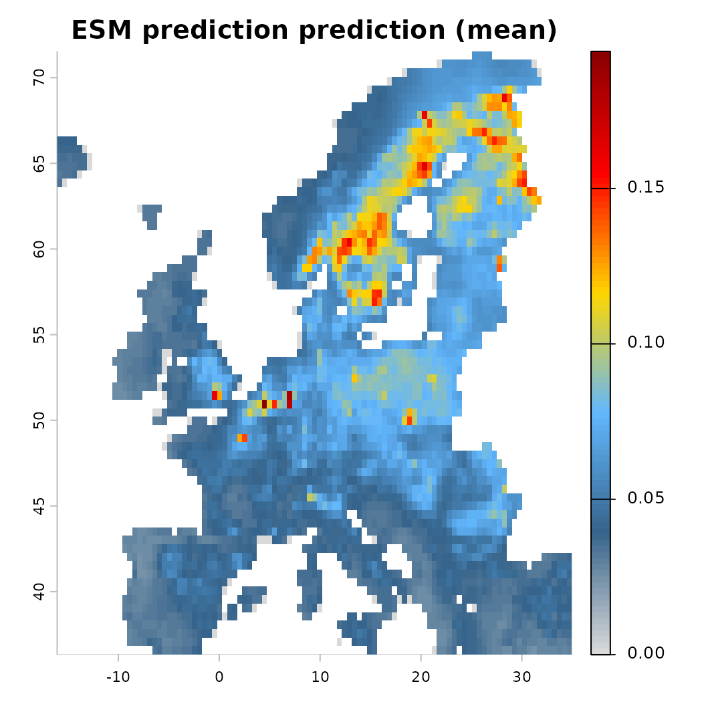
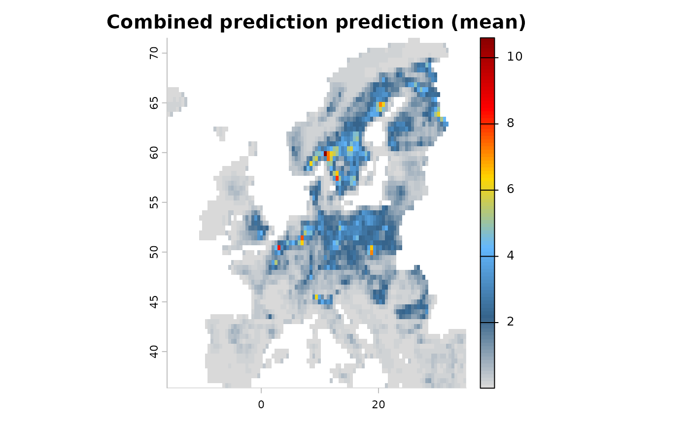

# Data integration

One of the key ambitions of the `ibis.iSDM` R-package is to provide a
comprehensive framework for model-based integration of different
biodiversity datasets and parameters. As ‘integration’ in the context of
SDMs we generally refer to as any approach where additional
observational data or parameters find their way into model estimation.
The purpose behind the integration can be:

- to correct for certain biases (spatial, environmental) in the primary
  dataset, taking advantage of different types of biodiversity sampling
  schemes.
- nudge data-driven algorithms towards estimates that are informed by
  domain knowledge (through offsets or priors) rather than letting the
  algorithm making naive uniformly distributed guesses.
- to provide a more comprehensive estimate of the distribution of a
  species distribution by relying on multiple sources of evidence.
  Particular when there are multiple surveys that complement each other.

There are thus multiple types of integration and we recommend to have a
look at [Fletcher et
al. (2019)](https://onlinelibrary.wiley.com/doi/abs/10.1002/ecy.2710)
and [Isaac et
al. (2020)](https://linkinghub.elsevier.com/retrieve/pii/S0169534719302551)
for an overview.

The [Package comparison
page](https://iiasa.github.io/ibis.iSDM/articles/07_package_comparison.md)
and the examples below provide some insight into what is currently
possible with regards to data integration in the ibis.iSDM R-package.
Additional methods, priors and engines are planned. Of course it is
equally possible to ‘integrate’ not only observational data and
parameters, but link entire models with ibis.iSDM outputs. More on this
in the scenario help page.

## Load relevant packages and testing data

``` r
# Load the package
library(ibis.iSDM)
library(inlabru)
library(glmnet)
library(xgboost)
library(terra)
library(igraph)
library(assertthat)

# Don't print out as many messages
options("ibis.setupmessages" = FALSE)
```

Lets load some of the prepared test data for this exercise. This time we
are going to make use of several datasets.

``` r
# Background layer
background <- terra::rast(system.file("extdata/europegrid_50km.tif",package = "ibis.iSDM", mustWork = TRUE))
# Load virtual species points
virtual_species <- sf::st_read(system.file("extdata/input_data.gpkg",package = "ibis.iSDM", mustWork = TRUE), "points", quiet = TRUE) 
virtual_range <- sf::st_read(system.file('extdata/input_data.gpkg', package='ibis.iSDM'), 'range', quiet = TRUE)

# In addition we will use the species data to generate a presence-absence dataset with pseudo-absence points.
# Here we first specify the settings to use:
ass <- pseudoabs_settings(background = background, nrpoints = 200,
                          method =  "random")
virtual_pseudoabs <- add_pseudoabsence(df = virtual_species, field_occurrence = "Observed",
                                       settings = ass)

# Predictors
predictors <- terra::rast(list.files(system.file("extdata/predictors/", package = "ibis.iSDM", mustWork = TRUE), "*.tif",full.names = TRUE))
# Make use only of a few of them
predictors <- subset(predictors, c("bio01_mean_50km","bio03_mean_50km","bio19_mean_50km",
                                            "CLC3_112_mean_50km","CLC3_132_mean_50km",
                                            "CLC3_211_mean_50km","CLC3_312_mean_50km",
                                            "elevation_mean_50km"))
```

We can define a generic model to use for any of the sections below.

``` r
# First define a generic model and engine using the available predictors
basemodel <- distribution(background) |> 
      add_predictors(env = predictors, transform = "scale", derivates = "none") |> 
      engine_inlabru() 
```

## Integration through predictors

The most simple way of integrating prior observations into species
distribution models is to add them as covariate. This is based on the
assumption that for instance an expert-drawn range map can be useful in
predicting where species exist might or might not find suitable habitat
(see for instance [Domisch et
al. 2016](http://doi.wiley.com/10.1111/ecog.01925)). A benefit of this
approach is that predictors can be easily added to all kinds of
`engines` in the ibis.iSDM package and also used for scenarios.

``` r

# Here we simply add the range as simple binary predictor
mod1 <- basemodel |>  
  add_predictor_range(virtual_range, method = "distance")

# We can see that the range has been added to the predictors object
# 'distance_range'
mod1$get_predictor_names()
#> [1] "bio01_mean_50km"     "bio03_mean_50km"     "bio19_mean_50km"    
#> [4] "CLC3_112_mean_50km"  "CLC3_132_mean_50km"  "CLC3_211_mean_50km" 
#> [7] "CLC3_312_mean_50km"  "elevation_mean_50km" "range_distance"
```

Expert-ranges can currently be added as simple `binary` or `distance`
transform. For the latter more options are available in the `bossMaps`
R-package as described in [Merow et
al. 2017](http://doi.wiley.com/10.1111/geb.12539).

Another option that has been added is the possibility to add thresholded
masks based on some elevational (or other) limits. The idea here is to
generate two layers, one with areas between a lower and an upper range
and one above the upper range. Regression against such thresholded
layers can thus approximate the lower and upper bounds. For instance
suppose a species is known to occur between 300 and 800m above sea
level, this can be added as follows:

``` r
# Specification 
basemodel <- distribution(background) |> 
      add_predictors(env = predictors, transform = "scale", derivates = "none")  |> 
      engine_inlabru() 

mod1 <- basemodel |> 
  add_predictor_elevationpref(layer = predictors$elevation_mean_50km,
                              lower = 300, upper = 800)

# Plot the threshold for an upper
plot( mod1$predictors$get_data()[[c("elev_low", "elev_high")]] )
```


------------------------------------------------------------------------

## Integration through offsets

Apart from including spatial-explicit prior biodiversity knowledge as
predictors in a SDM model, there is - particular for Poisson Process
Models (PPM) - also a different approach, that is to include the
variable as offset in the prediction. Doing so effectively tells the
respective engine to change intercepts and coefficients based on
existing knowledge, which can for instance be an existing coefficient.
Offsets can be specified as addition or as nuisance for a model, for
instance either by adding an expert-delineated range as offset or by
factoring out the spatial bias of areas with high sampling density or
accessibility. Multiple offsets can be specified for any given PPM by
simply multiplying them, since
$log\left( off_{1}*off_{2} \right) = log\left( off_{1} \right) + log\left( off_{2} \right)$.
A comprehensive overview of including offsets in SDMs can be found in
[Merow et al. (2016)](http://doi.wiley.com/10.1111/geb.12453).

``` r

# Specification 
mod1 <- distribution(background)  |>  
      add_predictors(env = predictors, transform = "scale", derivates = "none")  |> 
      add_biodiversity_poipo(virtual_species,field_occurrence = "Observed") |>  
      add_offset_range(virtual_range, distance_max = 5e5) |>  
      engine_glmnet() |>  
  # Train
  train(runname = "Prediction with range offset",only_linear = TRUE)

plot(mod1)
```


There are other ways to add offsets to the model object, either directly
([`add_offset()`](https://iiasa.github.io/ibis.iSDM/reference/add_offset.md))
as an externally calculated RasterLayer for instance with the “BossMaps”
R-package, to calculate as range
([`add_offset_range()`](https://iiasa.github.io/ibis.iSDM/reference/add_offset_range.md))
or elevation
([`add_offset_elevation()`](https://iiasa.github.io/ibis.iSDM/reference/add_offset_elevation.md))
offset, or also as biased offset
([`add_offset_bias()`](https://iiasa.github.io/ibis.iSDM/reference/add_offset_bias.md))
in which case the offset is removed from the prediction.

------------------------------------------------------------------------

## Integration through bias control

Sampling bias is a ubiquitous problem in presence-only biodiversity
data, where observations are often clustered near roads, cities, or
popular natural sites. The
[`add_control_bias()`](https://iiasa.github.io/ibis.iSDM/reference/add_control_bias.md)
function allows you to specify a covariate that accounts for this
spatial bias and partial it out of the prediction. The `bias_value`
parameter sets the value at which the bias covariate is held constant
during prediction (e.g., `0` to represent minimal bias).

``` r
# Load a human modification index layer as proxy for sampling bias
bias_layer <- terra::rast(system.file("extdata/predictors/hmi_mean_50km.tif",
                                       package = "ibis.iSDM", mustWork = TRUE))

# Train a model with bias control
mod_bias <- distribution(background) |> 
      add_predictors(env = predictors, transform = "scale", derivates = "none") |> 
      add_biodiversity_poipo(virtual_species, field_occurrence = "Observed") |> 
      # Add bias control: partial out the human modification index during prediction
      add_control_bias(layer = bias_layer, bias_value = 0) |>
      engine_glmnet() |> 
      train(runname = "Prediction with bias control", only_linear = TRUE)

plot(mod_bias)
```


------------------------------------------------------------------------

## Integration through Ensemble of Small Models (ESM)

When there are very few observations relative to the number of
predictors, fitting a full model can lead to overfitting. The Ensemble
of Small Models (ESM) approach ([Breiner et
al. 2015](https://doi.org/10.1111/2041-210X.12403)) addresses this by
fitting many bivariate models (one per pair of predictors) and then
combining them into an ensemble. This can be enabled via
[`add_control_esm()`](https://iiasa.github.io/ibis.iSDM/reference/add_control_esm.md).

``` r
# Train a model using the ESM approach
mod_esm <- distribution(background) |> 
      add_predictors(env = predictors, transform = "scale", derivates = "none") |> 
      add_biodiversity_poipo(virtual_species, field_occurrence = "Observed") |> 
      # Enable ESM: each bivariate model is trained separately and ensembled
      add_control_esm() |> 
      engine_glmnet() |> 
      train(runname = "ESM prediction", only_linear = TRUE)
#> Training 28 ESM GLMNET-Engine models with 2 predictors each.
#> [Setup] 2026-03-07 11:18:26.616172 | Replacing currently selected engine.
#> 
#> ! Overwriting previously defined engine.

plot(mod_esm)
```



------------------------------------------------------------------------

## Integration with priors

A different type of integration is also possible through the use of
informed priors, which can be set on fixed or random effects in the
model. In a Bayesian context a prior is generally understood as some
form of uncertain quantity that is meant to reflect the direction and/or
magnitude of model parameters and is usually known a-priori to any
inference or prediction. Offsets can also be understood as “priors”,
however in the context of SDMs, they are usually included as
spatial-explicit data, opposed to priors that are only available in
tabular form (such as known habitat affiliations). Since the ibis.iSDM
package supports a variety of engines and not all of them are Bayesian
in a strict sense (such as `engine_gdb` or `engine_xgboost`), the
specification of priors differs depending on the engine in question.

Generally \[`Prior-class`\] objects can be grouped into:

- Probabilistic priors with estimates placed on for example the mean
  ($\mu$) and standard deviation ($\sigma$) or precision in the case of
  \[`engine_inla`\]. Such priors usually allow the greatest amount of
  flexibility since they are able to incorporate information on both the
  sign and magnitude of a coefficient.

- Monotonic constraints on the direction of a coefficient and predictor
  in the model, such that is
  $f\left( x_{1} \right) > = f\left( x_{2} \right)$ or
  $f\left( x_{1} \right) < = f\left( x_{2} \right)$. Useful to
  incorporate for instance prior ecological knowledge on that a certain
  response function for example has to be positive.

- More complex priors specified on random spatial effects such as
  penalized complexity priors used for SPDE effects in
  \[[`add_latent_spatial()`](https://iiasa.github.io/ibis.iSDM/reference/add_latent_spatial.md)\].

- Probabilistic priors on the inclusion probability of a certain
  variable such as to what certainty the variable should or should not
  be included in a regularized outcome. For example used in the case of
  \[`engine_breg`\] or \[`engine_glmnet`\].

Prior specifications are specific to each engine and more information
can be found on the individual help pages of the
[`priors()`](https://iiasa.github.io/ibis.iSDM/reference/priors.md)
function.

``` r

# Set a clean base model with biodiversity data
x <- distribution(background) |> 
      add_predictors(env = predictors, transform = "scale", derivates = "none") |> 
      add_biodiversity_poipo(virtual_species, field_occurrence = "Observed") |>  
      engine_inlabru()

# Make a first model
mod1 <- train(x, only_linear = TRUE)

# Now assume we now that the species occurs more likely in intensively farmed land. 
# We can use this information to construct a prior for the linear coefficient.
p <- INLAPrior(variable = "CLC3_211_mean_50km",
               type = "normal",
               hyper = c(2, 1000) # Precision priors, thus larger sigmas indicate higher precision
               )
# Single/Multiple priors need to be passed to `priors` and then added to the model object.
pp <- priors(p)
# The variables and values in this object can be queried as well
pp$varnames()
#> b2353fd2-7f0e-4d29-a20b-f6747a54d93b 
#>                 "CLC3_211_mean_50km"

# Priors can then be added via 
mod2 <- train(x |> add_priors(pp), only_linear = TRUE)
# Or alternatively directly as parameter via add_predictors,
# e.g. add_predictors(env = predictors, priors = pp)

# Compare the difference in effects
p1 <- partial(mod1, pp$varnames(), plot = TRUE)
```


``` r
p2 <- partial(mod2, pp$varnames(), plot = TRUE)
```


There is also now a convenience function that allows to extract
coefficients or weights from an existing model when can then be passed
to another model or engine
([`get_priors()`](https://iiasa.github.io/ibis.iSDM/reference/get_priors.md)).
Only requirement is that a fitted model is provided as well as the
target engine for which coefficients/priors are to be created.

------------------------------------------------------------------------

## Integration with ensembles

Another very straight forward way for model-based integration is to
simply fit two separate models each with a different biodiversity
dataset and then create an ensemble from them. This approach also works
across different engines and a variety of data types (in some cases
requiring normalization given the difference in units and model
assumptions). (Note that it also possible to create an ensemble of
partial responses via
[`ensemble_partial()`](https://iiasa.github.io/ibis.iSDM/reference/ensemble_partial.md)).

``` r
# Create and fit two models
mod1 <- distribution(background) |>  
      add_predictors(env = predictors, transform = "scale", derivates = "none") |> 
      engine_glmnet() |> 
      # Add dataset 1 
      add_biodiversity_poipo(poipo = virtual_species, name = "Dataset1",field_occurrence = "Observed") |> 
      train(runname = "Test1", only_linear = TRUE)

mod2 <- distribution(background) |>  
      add_predictors(env = predictors, transform = "scale", derivates = "none") |> 
      engine_xgboost(iter = 5000) |>  
      # Add dataset 2, Here we simple simulate presence-only points from a range
      add_biodiversity_polpo(virtual_range, name = "Dataset2",field_occurrence = "Observed",
                             simulate = TRUE,simulate_points = 300) |>  
      train(runname = "Test1", only_linear = FALSE)

# Show outputs of each model individually and combined
plot(mod1)
```


``` r
plot(mod2)
```


``` r

# Now create an ensemble:
# By setting normalize to TRUE we furthermore ensure each prediction
# is on a comparable scale [0-1].
e <- ensemble(mod1, mod2, method = "mean", normalize = TRUE)

# The ensemble contains the mean and the coefficient of variation across all objects
plot(e)
```


------------------------------------------------------------------------

## Combined and joint likelihood estimation

In the examples above we always added only a single biodiversity data
source to a model to be trained, but what if we add multiple different
ones? As outlined by [Isaac et
al. 2020](https://linkinghub.elsevier.com/retrieve/pii/S0169534719302551)
joint, model-based integration of different data sources allows to
borrow strengths of different types of datasets (quantity, quality) for
more accurate parameter estimations as well as the control of biases.
Particular for SDMs it also has the benefit of avoiding to make
unreasonable assumptions about the absence of a species, as commonly
being done through the addition of pseudo-absences (despite being called
pseudo, any logistic likelihood function treats them as *true* absence).

Depending on the engine, the ibis.iSDM package currently supports either
combined or joint estimation of several datasets.

#### Combined integration

By default all engines that do not support any joint estimation (see
below) will make use of a combined integration, for which there are
currently three different options:

- “predictor”: The predicted output of the first (or previously fitted)
  models are added to the predictor stack and thus are predictors for
  subsequent models (Default).

- “offset”: The predicted output of the first (or previously fitted)
  models are added as spatial offsets to subsequent models. Offsets are
  back-transformed depending on the model family. This might not work
  for all likelihood functions and engines!

- “prior”: In this option we only make use of the coefficients from a
  previous model to define priors to be used in the next model. Note
  that this option creates priors based on previous fits and can result
  in unreasonable constrains (particular if coefficients are driven
  largely by latent variables). Can be used in projections
  ([`scenario()`](https://iiasa.github.io/ibis.iSDM/reference/scenario.md)).

- “interaction”: In the case of two datasets of the same type it also is
  possible to make use of factor interactions. In this case the
  prediction is made based on the first reference level (e.g. the first
  added dataset) with the others being “partialed” out during
  prediction. This method only works if one fits a model with multiple
  datasets on the same response (e.g. Bernoulli distributed). Can be
  used in projections
  ([`scenario()`](https://iiasa.github.io/ibis.iSDM/reference/scenario.md)).

- “weights”: This type of integration works only for two biodiversity
  datasets of the same type. Here the datasets are combined into one,
  however the observations are weighted through a `weights` parameter in
  each add_biodiversity call. This can be for example used to give one
  dataset an arbitrary (or expert-defined) higher value compared to
  another.

All of these can be specified as parameter in
[`train()`](https://iiasa.github.io/ibis.iSDM/reference/train.md).

**Note that for any of these methods (like “predictor” & “offset”),
models are trained in the sequence at which datasets are added!**

``` r
# Specification 
mod1 <- distribution(background) |>  
      add_predictors(env = predictors, transform = "scale", derivates = "none") |> 
    # A presence only dataset
      add_biodiversity_poipo(virtual_species,field_occurrence = "Observed") |>  
    # A Presence absence dataset
      add_biodiversity_poipa(virtual_pseudoabs,field_occurrence = "Observed") |>  
      engine_xgboost() |> 
  # Train
  train(runname = "Combined prediction",only_linear = TRUE,
        method_integration = "predictor")

# The resulting object contains only the final prediction, e.g. that of the presence-absence model
plot(mod1)
```


#### Joint likelihood estimation

Some engines, notably \[`engine_inla`\], \[`engine_inlabru`\] and
\[`engine_stan`\] support the joint estimation of multiple likelihoods.
The algorithmic approach in this package generally follows an approach
outlined where any presence-only datasets are modelled through a
log-Gaussian Cox process where the expected number of individuals are
estimated as a function of area $A$ following a Poisson distribution:

\$\$\begin{align\*} N(A) &\sim {\sf Poisson}\left(\int\_{A}
\lambda(i)\right) \\ \end{align\*}\$\$ $$\begin{array}{r}
{\log\left( \lambda(i) \right) = \alpha_{1} + \sum\limits_{k}^{K}\beta_{k}x_{i}}
\end{array}$$

where $N$ is the number of individuals, $A$ the Area for a given spatial
unit $i$, with $N(A)$ being an estimate of the relative rate of
occurrence per unit area (or ROR). $k$ is an increment for $K$ number of
predictors. $\lambda$ is the intensity function, $\alpha$ the intercept
and $\beta$ the parameter coefficients for environmental covariates.
Note that for interactions

Presence-absence data are estimated as draws from a *Bernoulli*
distribution:

\$\$\begin{align\*} Y\_{i} &\sim {\sf Bernoulli(p\_{i})}, i = 1, 2, ...
\\ \end{align\*}\$\$ $$\begin{aligned}
{\log\left( - \log\left( 1 - p_{i} \right) \right)} & {= \alpha_{2} + \sum\limits_{k}^{K}\beta_{k}x_{i}}
\end{aligned}$$

where $Y$ is the presence-absence of an record (usually a standardized
survey) as sampled from a *Bernoulli* distribution in a given spatial
unit $i$. $\alpha$ being the intercept and $\beta$ the parameter
coefficients for environmental covariates. The log-likelihood can be
understood as cloglog functon.

The Joint likelihood is then estimated by multiplying the two
likelihoods from above $\prod_{l}^{L}f(l)$, where $L$ is an individual
likelihood, with $\beta_{k}$ being shared parameters between the two
likelihoods. This works if we assume that
$cloglog\left( p_{i} \right) \approx log\left( \lambda(i) \right)$.
Equally it is also possible to add shared latent spatial effects such as
Gaussian fields (approximated through a stochastic partial differential
equation (SPDE)) to the model, assuming that there are shared factors -
or biases - affecting all datasets.

See the [Engine
comparison](https://iiasa.github.io/ibis.iSDM/articles/06_engine_comparison.md)
for an overview on which engines support which level of integration.

``` r

# Define a model
mod1 <- distribution(background) |>  
      add_predictors(env = predictors, transform = "scale", derivates = "none") |> 
    # A presence only dataset
      add_biodiversity_poipo(virtual_species,field_occurrence = "Observed") |>  
    # A Presence absence dataset
      add_biodiversity_poipa(virtual_pseudoabs,field_occurrence = "Observed") |>  
    # Use inlabru for estimation and default parameters.
    # INLA requires the specification of a mesh which in this example is generated from the data.
      engine_inlabru() |> 
  # Train
  train(runname = "Combined prediction", only_linear = TRUE)

# The resulting object contains the combined prediction with shared coefficients among datasets.
plot(mod1)
```



``` r

# Note how an overall intercept as well as separate intercepts for each dataset are added.
summary(mod1)
#> # A tibble: 11 × 8
#>    variable                   mean      sd      q05     q50    q95    mode   kld
#>    <chr>                     <dbl>   <dbl>    <dbl>   <dbl>  <dbl>   <dbl> <dbl>
#>  1 Intercept               -0.328  25.8    -42.8    -0.328  42.1   -0.328      0
#>  2 Intercept_X1d0bc915_po… -0.328  25.8    -42.8    -0.328  42.1   -0.328      0
#>  3 Intercept_X4609e1b6_po… -0.328  25.8    -42.8    -0.328  42.1   -0.328      0
#>  4 bio01_mean_50km         -0.109   0.134   -0.330  -0.109   0.112 -0.109      0
#>  5 bio03_mean_50km         -0.482   0.121   -0.681  -0.482  -0.283 -0.482      0
#>  6 bio19_mean_50km          0.472   0.0870   0.329   0.472   0.615  0.472      0
#>  7 CLC3_112_mean_50km       0.407   0.0496   0.325   0.407   0.488  0.407      0
#>  8 CLC3_132_mean_50km       0.0620  0.0496  -0.0197  0.0620  0.144  0.0620     0
#>  9 CLC3_211_mean_50km       0.898   0.0787   0.768   0.898   1.03   0.898      0
#> 10 CLC3_312_mean_50km       0.989   0.0660   0.880   0.989   1.10   0.989      0
#> 11 elevation_mean_50km      0.0251  0.0852  -0.115   0.0251  0.165  0.0251     0
```
