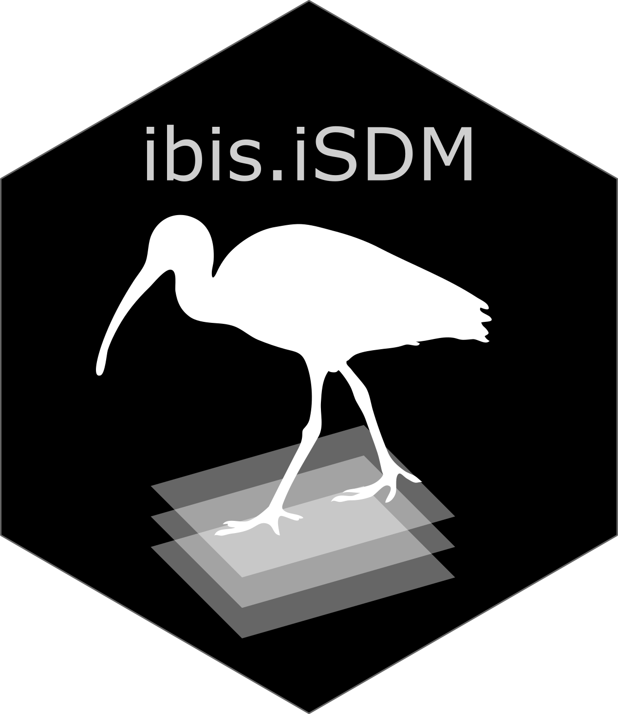

# The ibis framework - An **I**ntegrated model for **B**iod**I**versity distribution projection**S**



The **ibis.iSDM** package provides a series of convenience functions to
fit integrated Species Distribution Models (iSDMs). With integrated
models we generally refer to SDMs that incorporate information from
different biodiversity datasets, external parameters such as priors or
offsets with respect to certain variables and regions. See [Fletcher et
al. (2019)](https://doi.org/10.1002/ecy.2710) and [Isaac et
al. (2020)](https://linkinghub.elsevier.com/retrieve/pii/S0169534719302551)
for an introduction to iSDMs.

## Installation

The latest version can be installed from GitHub. A CRAN release is
planned, but in the meantime the package can be found on R-universe as
well.

``` r

# For installation (Not yet done)
install.packages("ibis.iSDM", repos = "https://iiasa.r-universe.dev")

# For Installation directly from github
install.packages("remotes")
remotes::install_github("IIASA/ibis.iSDM")
```

## Basic usage

See relevant [reference site](https://iiasa.github.io/ibis.iSDM/) and
[articles](https://iiasa.github.io/ibis.iSDM/articles/01_train_simple_model.html).

**Citation:**

Jung, Martin. 2023. “An Integrated Species Distribution Modelling
Framework for Heterogeneous Biodiversity Data.” Ecological Informatics,
102127, [DOI](https://doi.org/10.1016/j.ecoinf.2023.102127)

## Acknowledgement [](https://iiasa.ac.at)

**ibis.iSDM** is developed and maintained by the Biodiversity, Ecology
and Conservation group at the International Institute for Applied
Systems Analysis (IIASA), Austria.

## Contributors

All contributions to this project are gratefully acknowledged using the
[`allcontributors`
package](https://github.com/ropenscilabs/allcontributors) following the
[all-contributors](https://allcontributors.org) specification.
Contributions of any kind are welcome!

[TABLE]
